| Website                                                             | Address                                                                       |
| -------                                                             | -------                                                                       |
| GitHub Training Manual                                              | https://githubtraining.github.io/training-manual/#/                           |
| Getting Ready for Class                                             | https://githubtraining.github.io/training-manual/#/01_getting_ready_for_class |
| GitHub Flow                                                         | https://githubtraining.github.io/training-manual/#/03_github_flow             |
| Branching with Git                                                  ||
| Merging Pull Requests                                               ||
| Reverting Commits                                                   ||
| Git - Reference                                                     ||
| GitHub Git Cheat Sheet - GitHub Cheatsheets                         ||
| stash :: Git Cheatsheet :: NDP Software                             ||
| Git - git Documentation                                             ||
| Git - git-branch Documentation                                      ||
| Git - git-merge Documentation                                       ||
| Git - git-revert Documentation                                      ||
| Git - Book                                                          ||
| GitHub Documentation                                                ||
| Pull requests - GitHub Docs                                         ||
| About branches - GitHub Docs                                        ||
| Creating and deleting branches within your repository - GitHub Docs ||
| About merge conflicts - GitHub Docs                                 ||
| Resolving a merge conflict on GitHub - GitHub Docs                  ||
| Resolving a merge conflict using the command line - GitHub Docs     ||

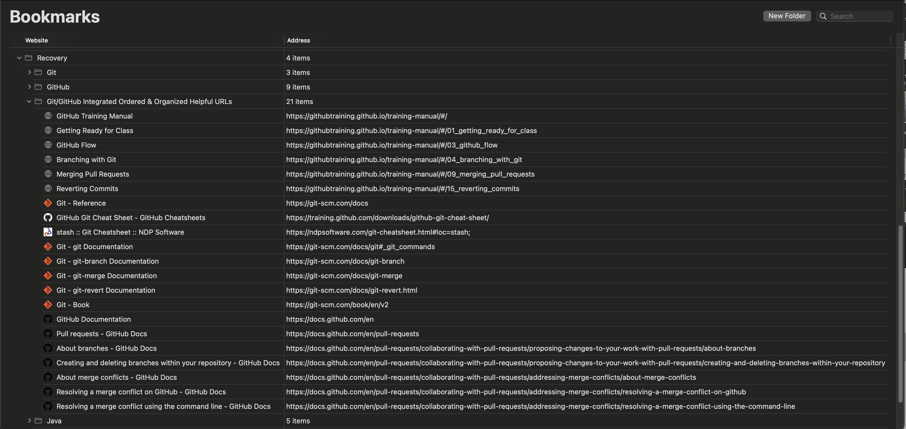
*Bookmarks for Integrated Ordered and Organized URLs*

*GitHub Training Manual link*

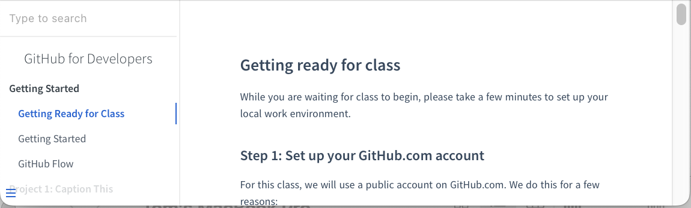
*GitHub Training Manual - Getting Ready for Class*

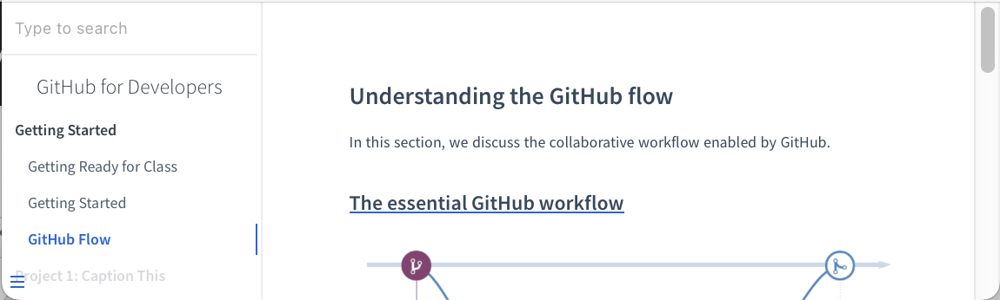
*GitHub Training Manual - GitHub Flow*

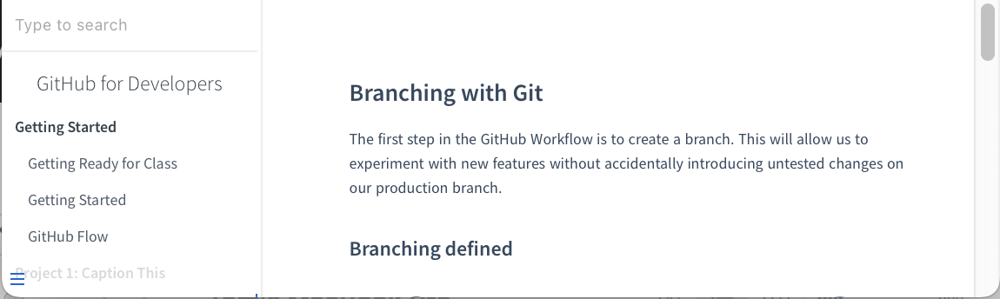
*GitHub Training Manual - Branching with Git*

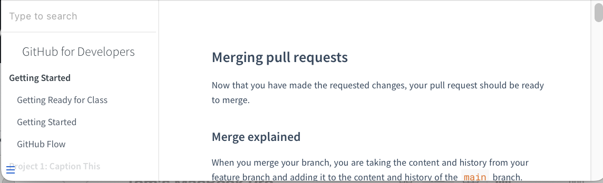
*GitHub Training Manual - Merging Pull Requests*

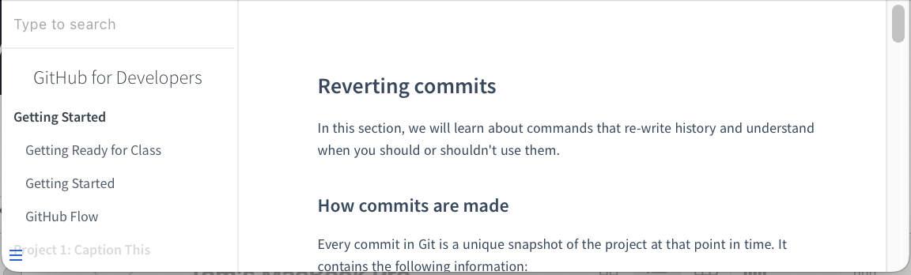
*GitHub Training Manual - Reverting Commits*

*git - Reference*

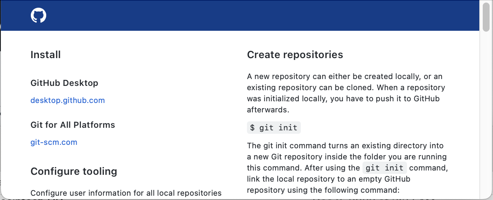
*git Cheat Sheet - GitHub*

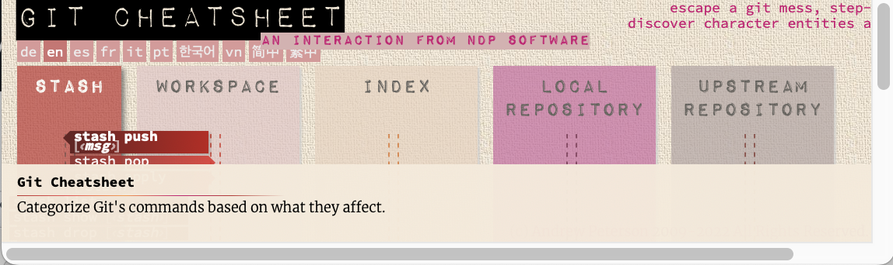
*git Cheat Sheet - NDP Software*

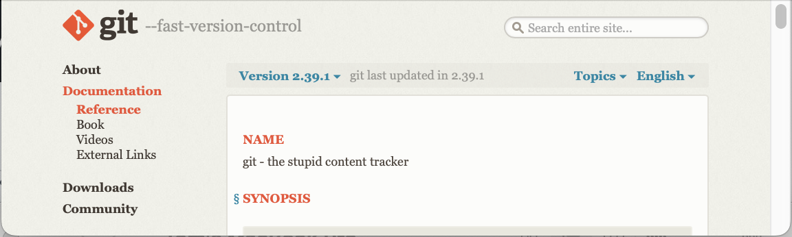
*git documentation*

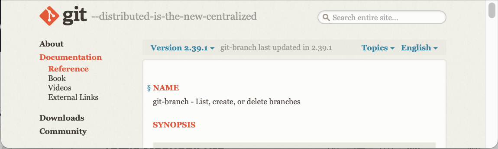
*git documentation: git-branch*

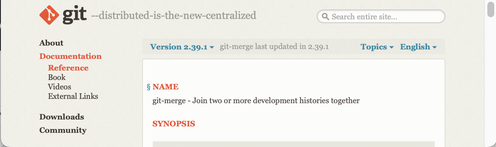
*git documentation: git-merge*

*git documentation: git-revert*

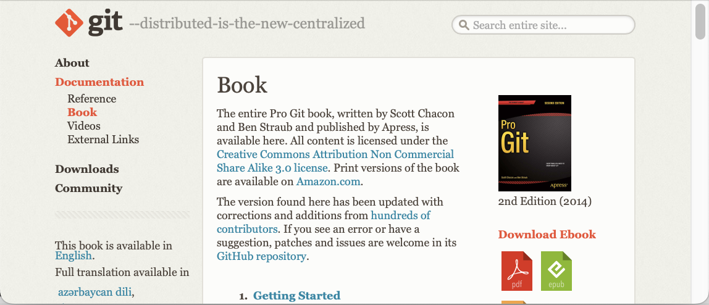
*A git Textbook*

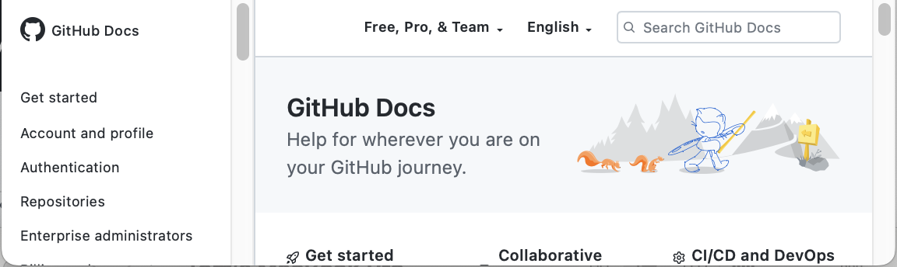
*GitHub Documentation*

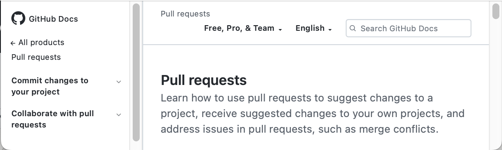
*GitHub Documentation: Pull Requests*

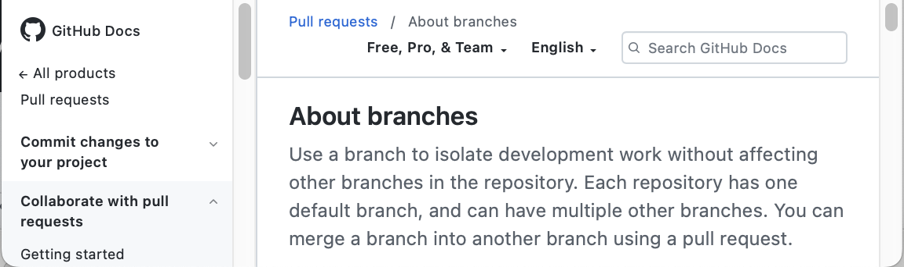
*GitHub Documentation: About Branches*

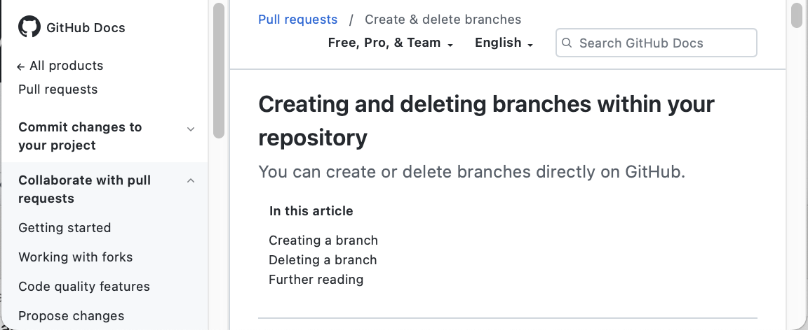
*GitHub Documentation: Creating And Deleting Branches*

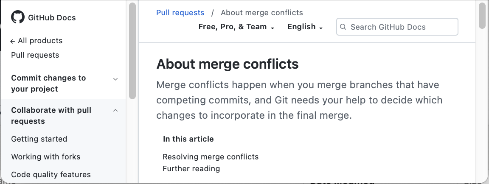
*GitHub Documentation: About Merge Conflicts*

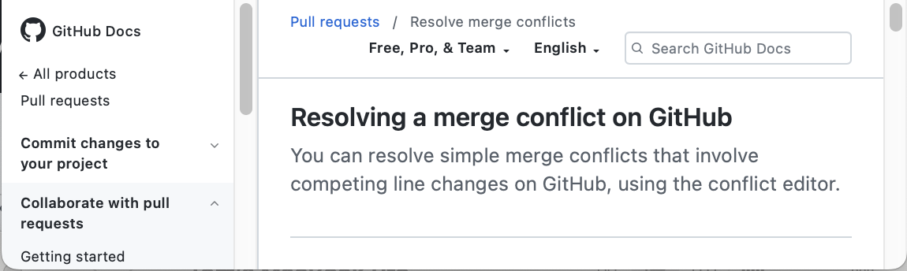
*GitHub Documentation: Resolving a Merge Conflict*

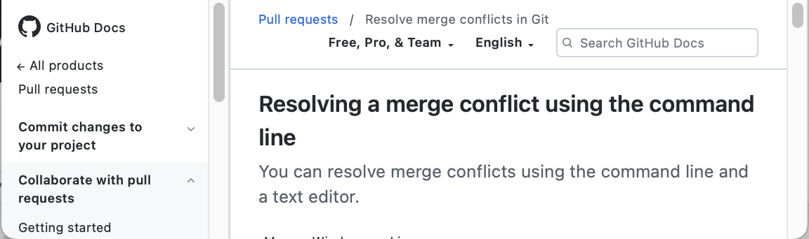
*GitHub Documentation: Resolving a Merge Conflict Using the Command Line*
